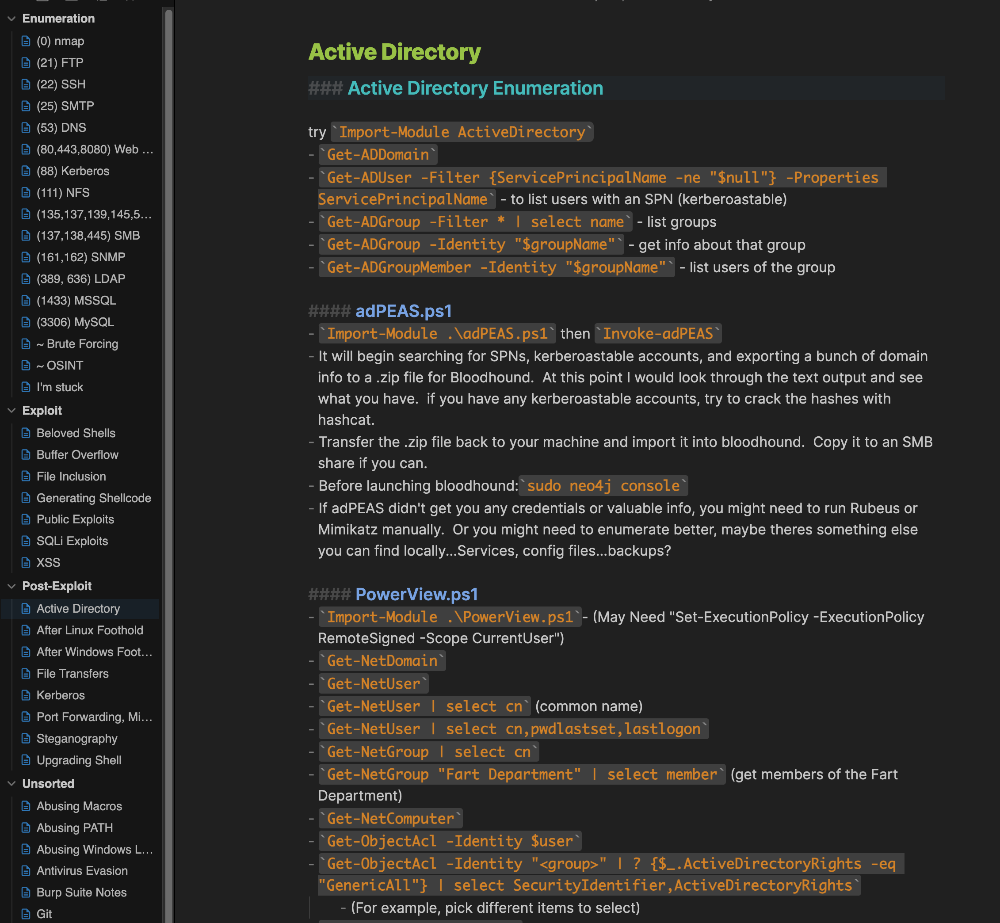

This folder is my Obsidian Vault for the OSCP. You can simply download the folder and open as an Obsidian Vault. Feel free to copy these and change them as you prefer. It looks kinda like this, Blue Topaz Dark theme in this case:

